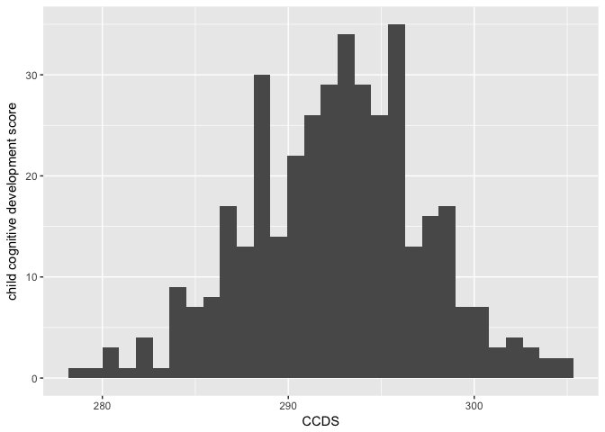

BST 232 Final Project
================
Rima Nakhala
12/11/2017

A neurotoxicity study on maternal exposure to metal pollutant in Bangladesh
---------------------------------------------------------------------------

A group of researchers is interested in investigating the effect of maternal exposure to manganese at high doses on child neuro-development in a sample of mother-infant pairs in Bangladesh. Bangladesh is experiencing an epidemic of metals and heavy metals poisoning. The soil of the country is contaminated with arsenic and manganese. Occupational and environmental exposure to lead is also a concern. The levels of arsenic, manganese, and lead found in Bangladesh can be extremely high and the support of these environmental toxicants poorly overlaps with what observed in Europe and in the USA.

In a sample of 400 mother infant pairs, the investigators measured child cognitive development (Y) at 24 months using the Bayley scales for infant neurodevelopment. Furthermore, they obtained a measure of concentrations of manganese (X1, mu/dl), the primary exposure of interest, as well as of arsenic (X2, mu/dl) and lead (X3, mu/dl) in cord blood. This measure reflects maternal exposure to these metals during pregnancy. An extensive questionnaire was filled at baseline by the mothers to collect information on potential confounders of the manganese-cognitive development relationship. These include child age at testing (Z1, months), mother education (Z2, years), mother age (Z3, centered at the mean), mother IQ (Z4, z-scored), home quality score (Z5), daily nutritional intake of egg (Z6), meat (Z7), fish (Z8), and maternal smoking status (Z9). The data is generated so that observations are be independent of each other and identically distributed (conditional on covariates). Under a certain model selection NUCA will hold. Note that not all covariates will be true confounders.

Link <https://www.kaggle.com/c/bst232>.

There are two aspects of the modeling that will be evaluated. 1) One aspect is the predictive ability of the model 2) and the other is the inferences about the causal effect of manganese on cognitive ability.

Data fields

     Y - child cognitive development score at 24 months (Bayley scales for infant neurodevelopment)
    X1 - concentrations of manganese (mu/dl)
    X2 - concentrations of arsenic in cord blood (mu/dl)
    X3 - concentrations of lead in cord blood (mu/dl)
    Z1 - mother age (months)
    Z2 - mother education (years)
    Z3 - mother age (centered at mean)
    Z4 - mother IQ (Z-score)
    Z5 - home quality score
    Z6 - daily nutritional intake of meat
    Z7 - daily nutritional intake of fish
    Z8 - daily nutritional intake of eggs
    Z9 - maternal smoking status

Structure of the dataframe
--------------------------

``` r
str(trainDF)
```

    ## 'data.frame':    400 obs. of  14 variables:
    ##  $ ID: int  2656 3722 5727 9081 2018 8981 9442 6605 6287 617 ...
    ##  $ X1: num  1.59 7.2 10.86 21.61 25.72 ...
    ##  $ X2: num  1.7 0.73 1.06 1.1 2.11 ...
    ##  $ X3: num  0.649 0.272 0.379 0.565 0.653 ...
    ##  $ Z1: num  23.7 19.2 26.3 23.7 22.9 ...
    ##  $ Z2: num  3.6 1.98 1.06 2.1 2.76 ...
    ##  $ Z3: num  0.702 -3.766 3.29 0.694 -0.107 ...
    ##  $ Z4: num  0.11 -0.277 0.485 -0.324 0.096 ...
    ##  $ Z5: num  43.6 41.2 39.9 39.1 41 ...
    ##  $ Z6: num  2.97 5.33 1.94 3.1 3.87 ...
    ##  $ Z7: num  1.34 5.68 2.99 2.67 1.99 ...
    ##  $ Z8: num  3.535 4.804 5.878 3.153 0.465 ...
    ##  $ Z9: int  1 1 0 0 1 0 1 1 1 1 ...
    ##  $ Y : num  290 299 291 290 288 ...

check if this data has missing values

``` r
table(is.na(trainDF))
```

    ## 
    ## FALSE 
    ##  5600

``` r
colnames(trainDF) <- c("ID","con_manganese",
                         "con_arsenic",
                         "con_lead",
                         "child_age_month",
                         "mom_edu_year",
                         "mom_age_mean",
                         "mom_IQ",
                         "home_QS",
                         "daily_meat",
                         "daily_fish",
                         "daily_eggs",
                         "smoking",
                         "CCDS")

colnames(testDF) <- c("ID","con_manganese",
                         "con_arsenic",
                         "con_lead",
                         "child_age_month",
                         "mom_edu_year",
                         "mom_age_mean",
                         "mom_IQ",
                         "home_QS",
                         "daily_meat",
                         "daily_fish",
                         "daily_eggs",
                         "smoking")


summary(trainDF)
```

    ##        ID       con_manganese       con_arsenic        con_lead      
    ##  Min.   : 130   Min.   :  0.5658   Min.   :0.2049   Min.   :0.06732  
    ##  1st Qu.:2618   1st Qu.:  4.2853   1st Qu.:0.7916   1st Qu.:0.28073  
    ##  Median :4749   Median :  8.4369   Median :1.2329   Median :0.42725  
    ##  Mean   :4975   Mean   : 14.9037   Mean   :1.3926   Mean   :0.50990  
    ##  3rd Qu.:7361   3rd Qu.: 17.4845   3rd Qu.:1.7808   3rd Qu.:0.62478  
    ##  Max.   :9990   Max.   :213.6956   Max.   :6.0018   Max.   :2.98608  
    ##  child_age_month  mom_edu_year      mom_age_mean           mom_IQ       
    ##  Min.   :10.50   Min.   :0.06241   Min.   :-12.48974   Min.   :-1.9211  
    ##  1st Qu.:20.16   1st Qu.:1.63815   1st Qu.: -2.82494   1st Qu.:-0.1385  
    ##  Median :23.08   Median :2.32830   Median :  0.09650   Median : 0.4114  
    ##  Mean   :22.89   Mean   :2.29671   Mean   : -0.09747   Mean   : 0.3485  
    ##  3rd Qu.:25.65   3rd Qu.:2.94509   3rd Qu.:  2.66554   3rd Qu.: 0.8180  
    ##  Max.   :33.61   Max.   :4.54556   Max.   : 10.62465   Max.   : 2.1586  
    ##     home_QS        daily_meat        daily_fish        daily_eggs     
    ##  Min.   :34.11   Min.   :0.03042   Min.   :0.08243   Min.   : 0.1851  
    ##  1st Qu.:39.87   1st Qu.:2.46063   1st Qu.:2.53912   1st Qu.: 3.7699  
    ##  Median :41.62   Median :3.37933   Median :3.33544   Median : 4.8565  
    ##  Mean   :41.47   Mean   :3.38854   Mean   :3.28383   Mean   : 4.7900  
    ##  3rd Qu.:43.20   3rd Qu.:4.25052   3rd Qu.:4.07239   3rd Qu.: 5.8596  
    ##  Max.   :49.69   Max.   :7.54889   Max.   :6.31609   Max.   :10.9457  
    ##     smoking            CCDS       
    ##  Min.   :0.0000   Min.   : 44.81  
    ##  1st Qu.:0.0000   1st Qu.:288.63  
    ##  Median :1.0000   Median :292.56  
    ##  Mean   :0.5375   Mean   :290.64  
    ##  3rd Qu.:1.0000   3rd Qu.:295.69  
    ##  Max.   :1.0000   Max.   :304.56

Graphical Representation of Variables
-------------------------------------

We can see that majority of high child cognitive development score has been observed with low level of manganese concentrations which indicates negative correlation

``` r
ggplot(trainDF, aes(x= CCDS, y = con_manganese)) + geom_point(size = 2.5, color="navy") + xlab("child cognitive development score") + ylab("Concentrations of Manganese)") + ggtitle("Concentrations of manganese by child's child cognitive development score")
```

 let us also see correlations to prove it

``` r
cor(trainDF$CCDS,trainDF$con_manganese)
```

    ## [1] -0.8094188

We can see outliers in child cognitive development score which can distort predictions and affect the accuracy, and we should remove it

``` r
quantiles <- quantile(trainDF$CCDS, probs = c(.25, .75))
range <- 1.5 * IQR(trainDF$CCDS)
trainDf_subset <- subset(trainDF,
trainDF$CCDS > (quantiles[1] - range) & trainDF$CCDS < (quantiles[2] + range))


qplot(data = trainDf_subset, x = CCDS) + ylab("child cognitive development score")
```

    ## `stat_bin()` using `bins = 30`. Pick better value with `binwidth`.



Remove Redundant Features
-------------------------

Calculate the correlation matrix of the numeric values in the dataset. Also correlated predictor variables brings down the model accuracy. we can see high coorelation between mean age and age in month so mom age mean will be removed

``` r
df.pearson <- cor(trainDf_subset[,1:12],use="pairwise.complete.obs",method="pearson")
corrplot(df.pearson, method="number")
```


``` r
trainDf_subset <-  select(trainDf_subset,con_manganese,
                         con_arsenic,
                         con_lead,
                         child_age_month,
                         mom_edu_year,
                         mom_IQ,
                         home_QS,
                         daily_meat,
                         daily_fish,
                         daily_eggs,
                         smoking,
                         CCDS)

training_set <- trainDf_subset[1:200,]
test_set <- trainDf_subset[-(1:200),]
```

Baseline Regression
-------------------

In order to set a baseline for the feature engineering process, fit a basic linear regression model to the dataset and evaluate its results in terms of accuracy.

Linear Regression takes following assumptions:

1-There exists a linear relationship between response and predictor variables 2-The predictor (independent) variables are not correlated with each other. Presence of collinearity leads to multicollinearity. 3-The error terms are uncorrelated. Otherwise, it will lead to autocorrelation. 4-Error terms must have constant variance. Non-constant variance leads to heteroskedasticity.

Adjusted R² measures the goodness of fit of a regression model. Higher the R², better is the model. Our R² = 0.9404

``` r
lm_model <- lm(CCDS ~ ., data=training_set)

summary(lm_model)
```

    ## 
    ## Call:
    ## lm(formula = CCDS ~ ., data = training_set)
    ## 
    ## Residuals:
    ##     Min      1Q  Median      3Q     Max 
    ## -5.3752 -0.6718 -0.0633  0.7282  3.0332 
    ## 
    ## Coefficients:
    ##                   Estimate Std. Error t value Pr(>|t|)    
    ## (Intercept)     248.244875   1.668561 148.778  < 2e-16 ***
    ## con_manganese    -0.133293   0.008554 -15.582  < 2e-16 ***
    ## con_arsenic      -0.119402   0.124369  -0.960  0.33826    
    ## con_lead          0.161225   0.346505   0.465  0.64226    
    ## child_age_month   0.118356   0.024050   4.921 1.87e-06 ***
    ## mom_edu_year      1.077375   0.099620  10.815  < 2e-16 ***
    ## mom_IQ           -0.333823   0.121732  -2.742  0.00669 ** 
    ## home_QS           0.747042   0.034617  21.580  < 2e-16 ***
    ## daily_meat        0.088500   0.069158   1.280  0.20223    
    ## daily_fish        2.975907   0.078209  38.051  < 2e-16 ***
    ## daily_eggs        0.050797   0.063761   0.797  0.42664    
    ## smoking          -0.780183   0.170124  -4.586 8.23e-06 ***
    ## ---
    ## Signif. codes:  0 '***' 0.001 '**' 0.01 '*' 0.05 '.' 0.1 ' ' 1
    ## 
    ## Residual standard error: 1.179 on 188 degrees of freedom
    ## Multiple R-squared:  0.9437, Adjusted R-squared:  0.9404 
    ## F-statistic: 286.5 on 11 and 188 DF,  p-value: < 2.2e-16

Let’s check out regression plot to find out more ways to improve this model

``` r
par(mfrow=c(2,2))
plot(lm_model)
```


Recursive Feature Selection
---------------------------

We define the control using a random forest selection function with Cross-Validated (20 fold) and 15 repeats, to see top5 features

``` r
# ensure the results are repeatable
set.seed(7)

# define the control using a random forest selection function
control <- rfeControl(functions=rfFuncs, method="cv", number=20, repeats = 15)
# run the RFE algorithm
results <- rfe(training_set[,1:11], training_set[,12], sizes=c(1:11), rfeControl=control)
# summarize the results
print(results)
```

    ## 
    ## Recursive feature selection
    ## 
    ## Outer resampling method: Cross-Validated (20 fold) 
    ## 
    ## Resampling performance over subset size:
    ## 
    ##  Variables  RMSE Rsquared RMSESD RsquaredSD Selected
    ##          1 3.011   0.6253 0.7385    0.19407         
    ##          2 2.237   0.8069 0.6183    0.12976         
    ##          3 2.082   0.8571 0.3822    0.05542         
    ##          4 2.050   0.8823 0.5195    0.07018         
    ##          5 2.220   0.8649 0.5323    0.07337         
    ##          6 1.953   0.8898 0.4830    0.06836        *
    ##          7 2.091   0.8777 0.5393    0.07765         
    ##          8 2.223   0.8652 0.5484    0.08308         
    ##          9 2.058   0.8779 0.5018    0.07052         
    ##         10 2.162   0.8660 0.5431    0.08973         
    ##         11 2.229   0.8644 0.5428    0.08628         
    ## 
    ## The top 5 variables (out of 6):
    ##    daily_fish, home_QS, con_manganese, mom_edu_year, daily_meat

``` r
# list the chosen features
predictors(results)
```

    ## [1] "daily_fish"      "home_QS"         "con_manganese"   "mom_edu_year"   
    ## [5] "daily_meat"      "child_age_month"

``` r
# plot the results
plot(results, type=c("g", "o"))
```


Feature Importance
------------------

As well, compute the Chi Squared test to measure the importance of the variables with respect to the target.

``` r
fi <- chi.squared(CCDS ~ ., training_set)
fi$feature_name <- rownames(fi)
fi <- fi[order(- fi$attr_importance),]
print(fi)
```

    ##                 attr_importance    feature_name
    ## daily_fish            0.5705830      daily_fish
    ## con_manganese         0.4716611   con_manganese
    ## home_QS               0.4238657         home_QS
    ## mom_edu_year          0.4110086    mom_edu_year
    ## con_arsenic           0.0000000     con_arsenic
    ## con_lead              0.0000000        con_lead
    ## child_age_month       0.0000000 child_age_month
    ## mom_IQ                0.0000000          mom_IQ
    ## daily_meat            0.0000000      daily_meat
    ## daily_eggs            0.0000000      daily_eggs
    ## smoking               0.0000000         smoking

Aslo conisder Information gain

``` r
ig <- information.gain(CCDS ~ ., training_set, unit = "log2")
# Sort by importance
ig$feature_name <- rownames(ig)
ig <- ig[order(- ig$attr_importance),]

print(ig)
```

    ##                 attr_importance    feature_name
    ## daily_fish            0.7436834      daily_fish
    ## con_manganese         0.1479928   con_manganese
    ## mom_edu_year          0.1444863    mom_edu_year
    ## home_QS               0.1245233         home_QS
    ## con_arsenic           0.0000000     con_arsenic
    ## con_lead              0.0000000        con_lead
    ## child_age_month       0.0000000 child_age_month
    ## mom_IQ                0.0000000          mom_IQ
    ## daily_meat            0.0000000      daily_meat
    ## daily_eggs            0.0000000      daily_eggs
    ## smoking               0.0000000         smoking

Remove less important feautres
==============================

``` r
tr_select <-  select(training_set,
                         con_manganese,
                         mom_edu_year,
                         home_QS,
                         daily_fish,
                         child_age_month,
                         CCDS)
cor(tr_select)
```

    ##                 con_manganese mom_edu_year     home_QS  daily_fish
    ## con_manganese      1.00000000  -0.13556790 -0.03594975 -0.19173588
    ## mom_edu_year      -0.13556790   1.00000000  0.03168689  0.20315537
    ## home_QS           -0.03594975   0.03168689  1.00000000  0.01651062
    ## daily_fish        -0.19173588   0.20315537  0.01651062  1.00000000
    ## child_age_month    0.16141365  -0.26967763 -0.05773623 -0.14853538
    ## CCDS              -0.45533355   0.37572607  0.40370609  0.80946778
    ##                 child_age_month       CCDS
    ## con_manganese        0.16141365 -0.4553335
    ## mom_edu_year        -0.26967763  0.3757261
    ## home_QS             -0.05773623  0.4037061
    ## daily_fish          -0.14853538  0.8094678
    ## child_age_month      1.00000000 -0.1274929
    ## CCDS                -0.12749286  1.0000000

Fit a second model
==================

fit a 2nd linear regression model with the important features based on wrappre methods, now our R² = 0.9326 which is slightly less than the baseline model

``` r
lm_model2 <- lm(CCDS ~ ., data=tr_select)
summary(lm_model2)
```

    ## 
    ## Call:
    ## lm(formula = CCDS ~ ., data = tr_select)
    ## 
    ## Residuals:
    ##     Min      1Q  Median      3Q     Max 
    ## -5.7694 -0.7564 -0.0447  0.8050  3.1679 
    ## 
    ## Coefficients:
    ##                   Estimate Std. Error t value Pr(>|t|)    
    ## (Intercept)     248.180440   1.673204 148.327  < 2e-16 ***
    ## con_manganese    -0.133492   0.008664 -15.407  < 2e-16 ***
    ## mom_edu_year      1.063388   0.100510  10.580  < 2e-16 ***
    ## home_QS           0.743953   0.036022  20.653  < 2e-16 ***
    ## daily_fish        2.983444   0.079159  37.689  < 2e-16 ***
    ## child_age_month   0.126477   0.023487   5.385 2.08e-07 ***
    ## ---
    ## Signif. codes:  0 '***' 0.001 '**' 0.01 '*' 0.05 '.' 0.1 ' ' 1
    ## 
    ## Residual standard error: 1.253 on 194 degrees of freedom
    ## Multiple R-squared:  0.9343, Adjusted R-squared:  0.9326 
    ## F-statistic:   552 on 5 and 194 DF,  p-value: < 2.2e-16

Plot model residuals

``` r
par(mfrow=c(2,2))
plot(lm_model2)
```


However, we try to predict with the test set to see how the 2nd model scores in term of RMSE

``` r
predicted <- predict(lm_model2, newdata =test_set, type = "response")
RMSE.lin.reg <- rmse(test_set$CCDS, predicted)
RMSE.lin.reg
```

    ## [1] 1.357717

Another model with cross validation
-----------------------------------

fit a linear model with same selected features but with 40-fold CV which is repeated 10 times

``` r
fitControl <- trainControl(method = "repeatedcv",
                           number = 40,
                           repeats = 10)

set.seed(825)
lm_model3 <- train(CCDS ~ ., data = tr_select, 
                 method = "lm", 
                 trControl = fitControl)
lm_model3
```

    ## Linear Regression 
    ## 
    ## 200 samples
    ##   5 predictor
    ## 
    ## No pre-processing
    ## Resampling: Cross-Validated (40 fold, repeated 10 times) 
    ## Summary of sample sizes: 195, 196, 196, 196, 194, 195, ... 
    ## Resampling results:
    ## 
    ##   RMSE      Rsquared 
    ##   1.193384  0.9486691
    ## 
    ## Tuning parameter 'intercept' was held constant at a value of TRUE

Predict again to see if the model is improved, although it shows in train set the RMSE score has improved to 1.19 the result with the test set showing the same score 1.35

``` r
predictedCV <- predict(lm_model3, newdata =test_set, type = "raw", trControl = fitControl)
newRMSE <- rmse(test_set$CCDS, predictedCV)

print(newRMSE)
```

    ## [1] 1.357717

Preditct CCDS for the original test dataframe and save file for upload
----------------------------------------------------------------------

``` r
results_prob <- predict(lm_model3, newdata = testDF, type = "raw")
testDF$CCDS <- results_prob
sub_file <- data.frame(ID = testDF$ID, Y = testDF$CCDS)
write.csv(sub_file, 'uploadRN.csv')
```
